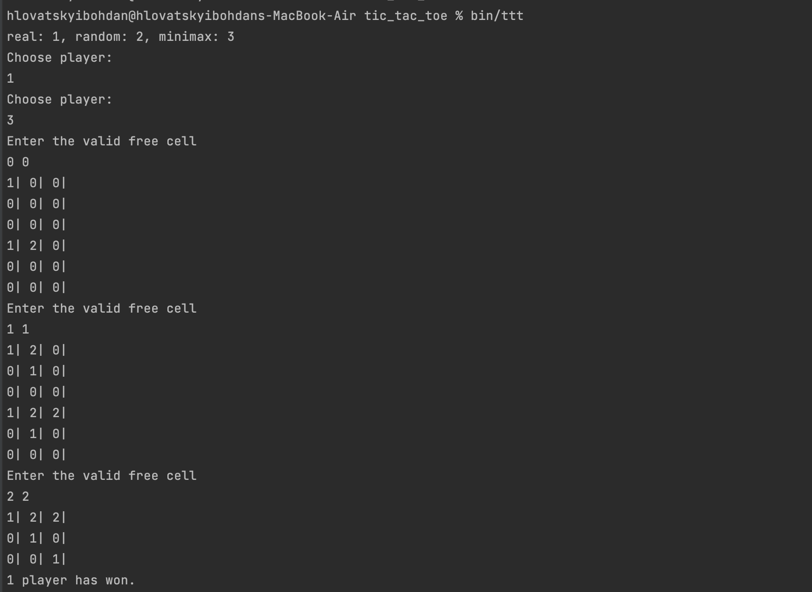

# Lab work <mark>3</mark>: <mark>Tic Tac Toe</mark>
Authors (team): <mark>bohdan hlovatskyi: https://github.com/bohdanhlovatskyi </mark><br>

## Prerequisites

Tested for C++17

### Compilation
```shell
./compile.sh

# or via CMakeLists direclty
mkdir build
cd build
cmake .. && make
```


### Usage


### What requires to be done? 

GameManager class (imho it would be weird for a game to
collect all the info), though at the current stage
it would bring complexity that is not needed yet.

On changing visualizer on the fly - the most obvious solution for me is to create this visualizer in the game manager and run it in separate thread.
This will make working with GUI much simpler, as we can substitute the calls to cout with passing message via queue to the visualizer.
It won't be then needed by the Game class to conduct actual visualization.
